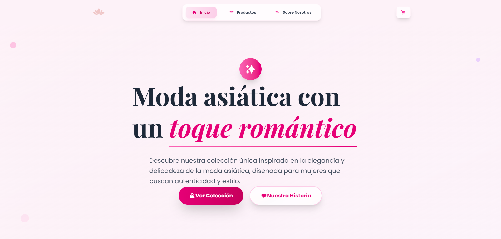
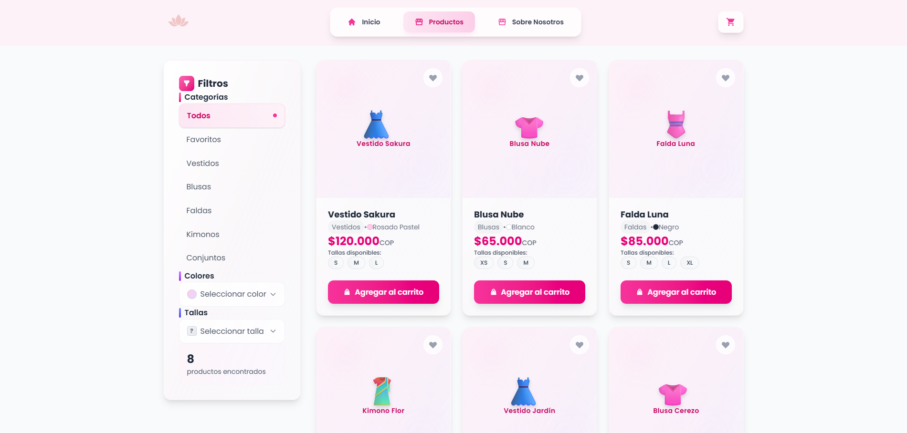
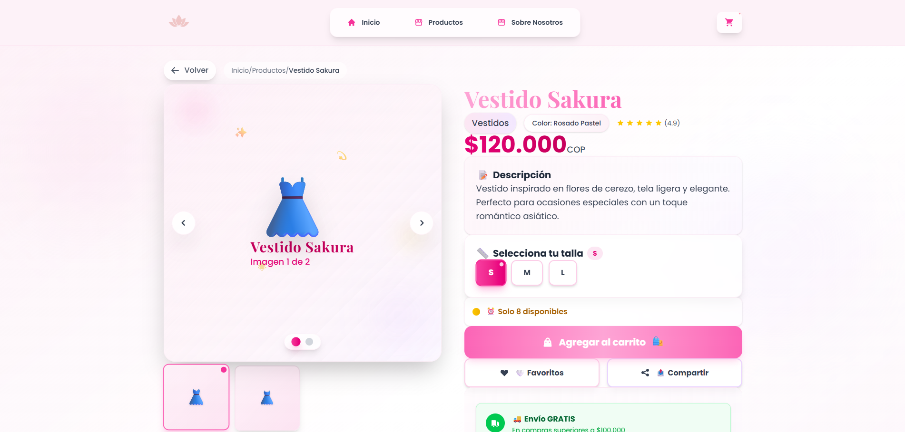
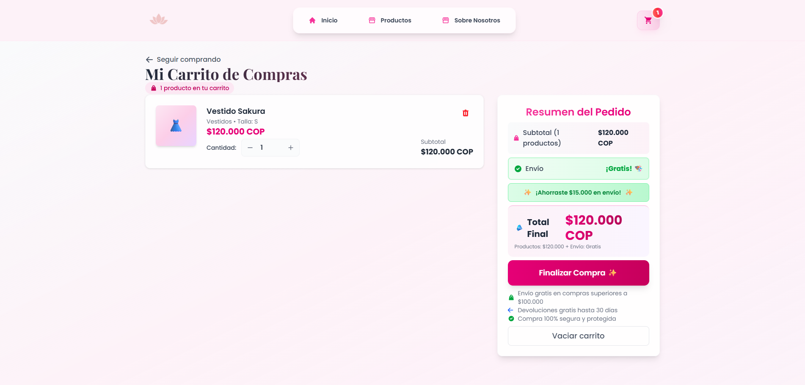

# 🌸 Cielo Rosa - Modern Women's Fashion E-commerce

A beautiful, modern e-commerce web application for women's fashion built with React, featuring stunning animations, elegant design, and a seamless shopping experience.



## ✨ Features

### 🛍️ Complete E-commerce Experience

- **Product Catalog** with advanced filtering and search
- **Shopping Cart** with persistent localStorage storage  
- **Favorites System** with global state management
- **Product Details** with interactive galleries and size selection
- **Responsive Design** optimized for all devices

### 🎨 Modern Design & Animations

- **Glassmorphism UI** with beautiful transparent effects
- **Framer Motion Animations** for smooth, professional interactions
- **Gradient Backgrounds** and modern color schemes
- **Epic Hover Effects** and micro-interactions
- **Custom 404 Page** with delightful animations

### ⚡ Technical Excellence

- **React 18** with modern hooks and context
- **React Router DOM** for seamless navigation
- **Tailwind CSS v4** for utility-first styling
- **Vite** for lightning-fast development
- **LocalStorage Persistence** for cart and favorites
- **Performance Optimized** animations and rendering

## 📸 Screenshots

### 🏠 Homepage


*Modern hero section with elegant animations and product showcases*

### 🛍️ Product Catalog



*Advanced filtering system with glassmorphism sidebar and smooth animations*

### 🎯 Product Details



*Interactive product galleries with epic animations and size selection*

### 🛒 Shopping Cart



*Smart cart with dynamic shipping calculation and elegant checkout process*

## 🚀 Getting Started

### Prerequisites
- Node.js (v18 or higher)
- pnpm (recommended) or npm

### Installation

1. **Clone the repository**
   ```bash
   git clone https://github.com/sasukemc7/cielo-rosa.git
   cd cielo-rosa
   ```

2. **Install dependencies**
   ```bash
   pnpm install
   # or
   npm install
   ```

3. **Start development server**
   ```bash
   pnpm run dev
   # or
   npm run dev
   ```

4. **Build for production**
   ```bash
   pnpm run build
   # or
   npm run build
   ```

## 🛠️ Tech Stack

### Frontend
- **React 18** - Modern React with hooks and context
- **React Router DOM** - Client-side routing
- **Framer Motion** - Professional animations and transitions
- **React Icons** - Beautiful icon library
- **Tailwind CSS v4** - Utility-first CSS framework

### Development Tools
- **Vite** - Next generation frontend tooling
- **ESLint** - Code linting and quality
- **PostCSS** - CSS processing

### Deployment
- **Netlify** - Optimized for SPA deployment
- **GitHub Pages** - Alternative deployment option

## 🎯 Key Features Implementation

### 🔄 State Management
- **Context API** for global state (Cart & Favorites)
- **localStorage** integration for data persistence
- **Custom hooks** for reusable logic

### 🎨 Animation System
- **Staggered animations** for list items
- **Page transitions** with Framer Motion
- **Hover effects** and micro-interactions
- **Loading states** with skeleton screens

### 📱 Responsive Design
- **Mobile-first** approach
- **Tablet and desktop** optimizations
- **Touch-friendly** interactions
- **Cross-browser** compatibility

## 🌟 Project Highlights

### ✨ Epic Animations
Every interaction is carefully crafted with smooth, performant animations that enhance the user experience without overwhelming it.

### 🎨 Glassmorphism Design
Modern UI/UX with transparent backgrounds, backdrop blur effects, and elegant gradients throughout the application.

### 🛒 Smart Shopping Cart
- Dynamic shipping calculation (free shipping over $100,000 COP)
- Persistent storage across browser sessions
- Real-time price updates and inventory management

### ❤️ Favorites System
Global favorites management with instant synchronization across all pages and persistent storage.

### 🎭 Custom 404 Page
Delightful 404 experience with animated elements and helpful navigation options.

## 👥 Team

**Founders of Cielo Rosa:**
- **Simón Durán** - Co-Founder & Lead Developer
- **Maria Fernanda Alfonso** - Co-Founder
- **Salome Zuluaga** - Co-Founder

## 📄 License

This project is open source and available under the [MIT License](LICENSE).

## 🤝 Contributing

Contributions, issues, and feature requests are welcome! Feel free to check the [issues page](../../issues).

## 🌟 Show your support

Give a ⭐️ if this project helped you or if you liked it!

---

<div align="center">
  <p>Made with ❤️ by the Cielo Rosa team</p>
  <p>🌸 Where fashion meets passion and elegance ✨</p>
</div>
